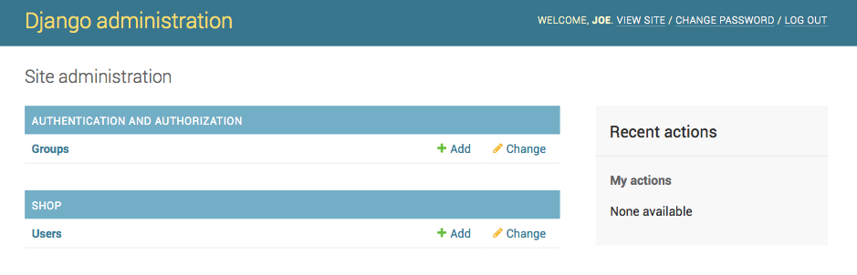
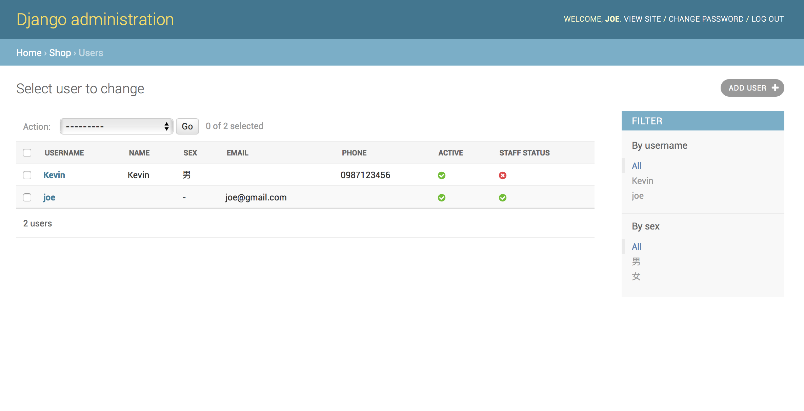
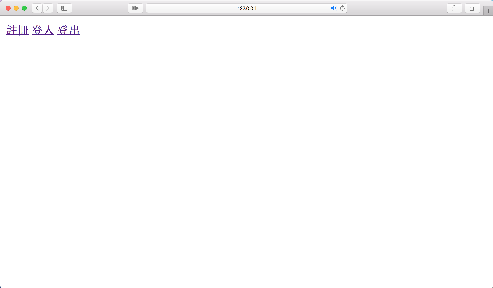

# 製作能讓使用者註冊及登入的頁面 #

> 目錄

- [需求](#requirement)
- [環境](#environment)

- [建立model](#model)
- [建立資料庫、superuser](#database_superuser)
- [使用python shell建立新的user](#shell)
- [建立首頁、URL pattern](#home)
- [建立註冊頁面](#register)
- [登入、登出](#log)
- [個人頁面修改](#revise)
<a name='requirement'></a>
> 需求
1. 使用者能註冊，包含*帳號、密碼、姓名、性別、電話號碼、郵件*
2. 使用者能登入跟登出
3. 使用者能修改資料，僅限*密碼、姓名、性別、電話號碼、郵件*
4. 能夠讓*後台(admin)*查看所有使用者資料
> 環境
- [python3.6](https://www.python.org)
- [Django1.11.11](https://www.djangoproject.com)
<a name="environment"></a>
> 建立環境

確認python,Django版本
```
$ python -V #python3.6.3
$ python -m django --version #django1.11.11
```  

使用Django建立專案**my_web**  
```
$ django-admin.py startproject myweb
```  
建立完成後執行下列指令  
```console
$ python manage.py runserver
```  
看見成功的頁面即可繼續。  

建立一個app叫**shop**
```console
$ python manage.py startapp shop
```  

*在django的一個project裡可以有很多application，每個app都是獨立的，可視為套件，可以給不同的project使用或給其他人使用*

建立好app後，先記得在project裡的settings.py中的**INSTALLED_APPS**登錄  
```python
# myweb/settings.py  
INSTALLED_APPS = [
'django.contrib.admin',
'django.contrib.auth',
'django.contrib.contenttypes',
'django.contrib.sessions',
'django.contrib.messages',
'django.contrib.staticfiles',
'shop',
]
```
<a name="model"></a>
>##  建立model
> > 如果app需要使用到資料庫，models的功用就是建立table和定義各欄位。

考慮到我們的應用，我們需要讓使用者登入，還要儲存姓名等額外資料。

光是讓使用者登入就必須花不少力氣，首先*username*也就是我們習慣稱的*帳號*必須滿足  `唯一性(Uniqueness)` ，還有password在資料庫儲存的型態必須為hash過的，也就是密碼不能以明文儲存在資料庫中。[(Password management in Django)](https://docs.djangoproject.com/en/2.1/topics/auth/passwords/#password-management-in-django)  
為了使開發者快速建立應用，Django提供AbstractUser來讓開發者新增所欄位，AbstractUser大致上滿足我們對於管理使用者帳號密碼的想像需求(或許它還想到你還沒想到的)而不用擔心密碼儲存方式、Permission等問題[(source code of AbstractUser)](https://github.com/django/django/blob/master/django/contrib/auth/models.py)。
接下來我們使用AbstractUser來新增我們想要的欄位。

```python
# shop/models.py
from django.db import models
from django.contrib.auth.models import AbstractUser
from django.core.validators import RegexValidator
class User(AbstractUser):
    gender = (
        ("male", '男'),
        ("female", '女')
    )
    phone_reg = RegexValidator(r'^09\d{2}-?\d{3}-?\d{3}$',"Please enter valid Taiwanese phone number.")
    name = models.CharField(max_length=20)
    email = models.EmailField(blank=True)
    sex = models.CharField(max_length=10,choices=gender)
    phone = models.CharField(max_length=20, validators=[phone_reg])

    def __str__(self):
        return self.name
```
> Django 提供了許多[Field types](https://docs.djangoproject.com/en/2.1/ref/models/fields/#field-types)，像是最常用的CharField，和信箱的EmailField，可以防止使用者在更新或註冊的時有錯誤。
> 
>
>首先考慮我們所需要的欄位
> 
> 1. 帳號(username):此部分由AbstractUser提供
> 2. 密碼(password):AbstractUser提供
> 3. 姓名(name):CharField
> 4. 信箱(email):EmailField(blaank設為True代表此欄位非必要)
> 5. 性別(sex):CharField(特別使用choices限制註冊只能選擇男or女)
> 6. 手機(phone):CharField(使用regex限制註冊要使用正常的手機號碼)

到`myweb/settings.py`加入  
```python
AUTH_USER_MODEL = 'shop.User'
```  
代表我們不使用Django預設的User模型，改用我們定義的模型。

建立完model之後，如果希望在admin後台查看資料，需要到該app資料架下的`admin.py`註冊  

```python
# shop/admin.py
from django.contrib import admin
from django.contrib.auth.admin import UserAdmin
# Register your models here.

admin.site.register(User,UserAdmin)
```
<a name="database_superuser"></a>
> ## 建立資料庫、superuser

完成`models.py`後，就要migrate到資料庫。

首先是`makemigrations`此段指令是透過`models.py`在原app底下建立`migrations`資料下記錄對model的更動，並提供之後`migrate`所需的SQL commands。而`migrate`執行產生的SQL commands。

```console
$ python manage.py makemigrations
$ python manage.py migrate
```

> 建立superuser
```console
$ python manage.py createsuperuser
```
接著會需要輸入帳號及密碼，完成之後打開瀏覽器輸入網址[127.0.0.1:8000/admin](127.0.0.1:8000/admin)會看到以下頁面


登入之後會看到以下頁面


<a name="shell"></a>
> 使用Python Shell建立user
> > Django 提供可以互動的Shell，如果不熟悉SQL command，可以透過Shell來對操作資料庫。
[更多操作可以參考此連結](https://docs.djangoproject.com/en/2.1/topics/db/queries/)

```
$ python manage.py shell
Python 3.6.3 (v3.6.3:2c5fed86e0, Oct  3 2017, 00:32:08)
[GCC 4.2.1 (Apple Inc. build 5666) (dot 3)] on darwin
Type "help", "copyright", "credits" or "license" for more information.
(InteractiveConsole)
>>> from shop.models import User
>>> user = User(username="Kevin", password="password_test")
>>> user.phone = "0987123456"
>>> user.sex = "male"
>>> user.name = "Kevin"
>>> user.save()
>>> quit()
```
在admin頁面SHOP下的Users就會新增Kevin，點進去如下圖


<a name="home"></a>
> ## 建立首頁、URL pattern  
首先在`shop`下建立`templates`資料夾，templates會儲存`shop`需要的html模板。先新增`home.html、 ligin.html、 personal.html、 register.html`空白檔案。

先完成`home.html`
```html
<!--shop/templates/home.html-->
<a href="register">註冊</a>
<a href="login">登入</a>
<a href="logout">登出</a>
```

在`shop/views.py`加入以下程式
```python
def home(request):
    return render(request,'home.html')
def register(request):
    return render(request,'register.html')
def User_login(request):
    return render(request,'login.html')
def personal(request):
    return render(request,'personal.html')
def User_logout(request):
    return render(request,'home.html')
```
> 在Django中，`views.py`負責接收網頁的請求(request)並回傳對應的網頁內容[(Document of views in Django)](https://docs.djangoproject.com/en/2.1/topics/http/views/#writing-views)

接下來是網頁最重要的內容，就是URL pattern，怎樣的URL對應到的網頁內容雖然可以隨便定義，但是良好的設計除了方便除錯，精簡而有意義的設計也可以增加使用者的好感。[(URL design)](https://indieweb.org/URL_design)

在`shop`資料夾下新增`urls.py`
```python
# shop/urls.py
from django.conf.urls import url
from . import views

urlpatterns = [
    url(r'^$',views.home),
    url(r'^register/',views.register),
    url(r'^login/',views.User_login),
    url(r'^personal/',views.personal),
    url(r'^logout/',views.User_logout),
]
```
在`myweb`底下的`urls.py`新增`shop`的url
```python
# myweb/urls.py
from django.conf.urls import url, include
from django.contrib import admin

urlpatterns = [
    url(r'^admin/', admin.site.urls),
    url(r'^',include('shop.urls')),
]
```
再次打開[127.0.0.1:8000](127.0.0.1:8000)，會發現頁面已經變成home.html的樣子


<a name="register"></a>
> ## 建立註冊頁面
>> 一個註冊的頁面對html來說就是一個`form`，利用`POST`方法對資料庫做新增動作。而Django也提供了快速製作form的方法[(Working with froms)](https://docs.djangoproject.com/en/2.1/topics/forms/)

heello